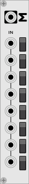

# mtsch plugins

My modules for [VCVRack](https://github.com/VCVRack/Rack).

### Rationals

Modify a volt/octave input by a rational number. Outputs constants on no input.
The rationals can be controlled by CV inputs at the top. Useful for making
music in [just intonation](https://en.wikipedia.org/wiki/Just_intonation) (see
[`examples`](examples) for basic examples).

Multiple Rationals can be daisy chained, see
[`examples/example-rationals2.vcv`](examples/example-rationals2.vcv). Use Sum to
combine outputs of multiple Rationals.

### Sum

Add, subtract or mute signals.

Note that this adds the signals directly, so make sure to attentuate the output
signal when adding audio signals.

## Thanks

Digital display in Rationals taken from
[luckyxxl](https://github.com/luckyxxl/vcv_luckyxxl).
