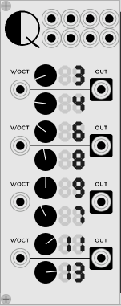
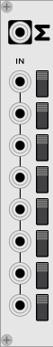

# mtsch plugins

Two modules for [VCVRack](https://github.com/VCVRack/Rack).

### Rationals

Modify a volt/octave input by a rational number. Outputs constants on no input.
The rationals can be controlled by CV inputs at the top. Useful for creating
music in just intonation (see
[`examples/example-rationals.vcv`](examples/example-rationals.vcv) for a basic
example).

### Sum

Add, subtract or mute signals.
